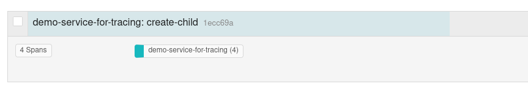
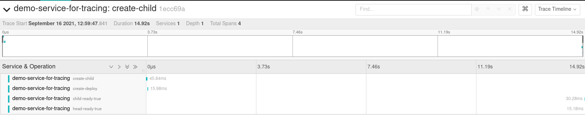

# A primitive POC for tracing k8s operators


## Motivation

While thinking about observability of our k8s operators under github.com/kubevirt project, we discussed tracing implementation. I did an investigation about whether there is a ready-to-use solution and how we can implement a tracing mechanism for our operators.


## Findings

- There are KEP about operator tracing but there is not ready-to-use solution yet.
  - APIServer Tracing https://github.com/kubernetes/enhancements/tree/master/keps/sig-instrumentation/647-apiserver-tracing
  - Trace context propagation https://github.com/kubernetes/enhancements/pull/2312
- A good blog post https://yue9944882.github.io/posts/how-to-monitor-kubernetes-operator-by-distributed-tracing/
- Since k8s operators don't work in a synchronous way, it is really hard to implement a tracing mechanism like the traditional ones for HTTP or gRPC. We can only propagate a tracing context from top to bottom in CR hierarchy by using annotations and create some spans for specific actions in controllers such a creation of a children, status update etc.  

## What is implemented here

- 1 operator with
  - Head Webhook -> Injects a tracing context into new `Head` objects
  - Head Controller -> Reconciles `Head` objects, creates `ChildA` objects, updates `Head` status accordingly
  - ChildA Controller -> Reconciles `ChildA` objects, creates `Deployment` objects, updates `ChildA` status accordingly
  
## How to try

### Requirements

- Get an OpenShift cluster
- Install (Jaeger Operator)[https://docs.openshift.com/container-platform/4.8/jaeger/jaeger_install/rhbjaeger-installation.html]
- Deploy a Jaeger instance with `all-in-one-inmemory` profile

### Deploy

```
make install && make deploy
```

### Create a `Head` object

```
oc apply -f config/samples/dummy_v1alpha1_head.yaml
```

### Results

- Go to Jaeger UI (check routes for full url)
- Pick `demo-services-for-tracing`, Click `Find Traces`
- Observe a trace like below



- Observe spans like below


